# 開発環境

このドキュメントでは `nidonehsp` における開発環境の構築について説明していきます。

`nidonehsp` 自体の文法や仕様については [クイックリファレンス][1] を参照してください。

## 開発のフロー

`nidonehsp` では大きく 2 つの開発フローを想定しています。

1 つ目は VSCode を使った開発環境で、VSCode に `nidonehsp` 用のエクステンションをインストールすることでスクリプトのシンタックスハイライトからデバッグ実行、実行ファイルの生成まで開発フロー全般がサポートされます。

2 つ目は `nidonehsp` のコマンドラインツールを使った開発環境で、`n2studio` というコマンドラインツールを通してデバッグ実行やコンパイル、実行ファイル生成を行います。\
`n2studio` は単体でデバッグ実行などをサポートしますが、一方で共通インクルードファイルや実行ファイルランタイムなどは別ファイル化されており、これらが `n2studio` から参照できる必要があります。

開発環境としては 1 つ目の VSCode を使った環境が推奨されます。

## VSCode を使った開発

本節では VScode を使った開発フローについて説明していきます。

### VSCode のインストール

[Visual Studio Code](https://code.visualstudio.com/) の公式サイトからダウンロード・インストールしてください。

### `nidonehsp-env` の拡張機能のインストール

[nidonehspのリポジトリ][2] の[リリースページ](https://github.com/exrd/nidonehsp/releases)に拡張機能ファイル（`.vsix`）がアップロードされています。

このリリースページから拡張機能ファイルをダウンロードしてください。

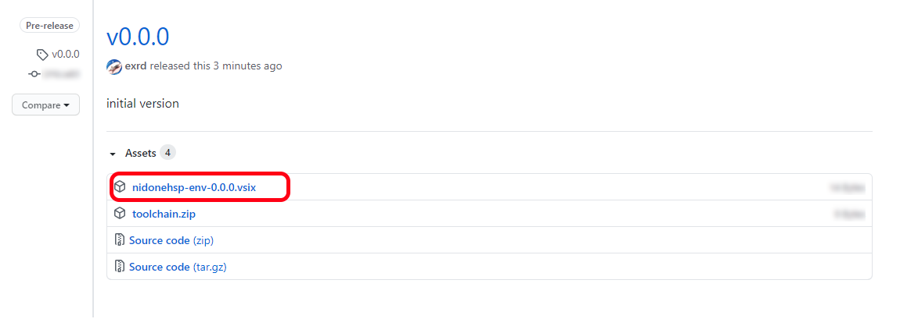

その後VSCodeを起動し、拡張機能ペインから `VSIXからインストール` を選び、ダウンロードした拡張機能フィルを選択します。

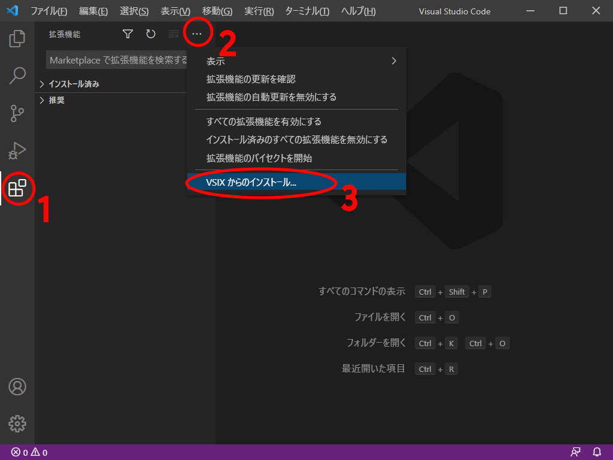

インストールされると、拡張機能の一覧に `nidonehsp-env` が追加されます。

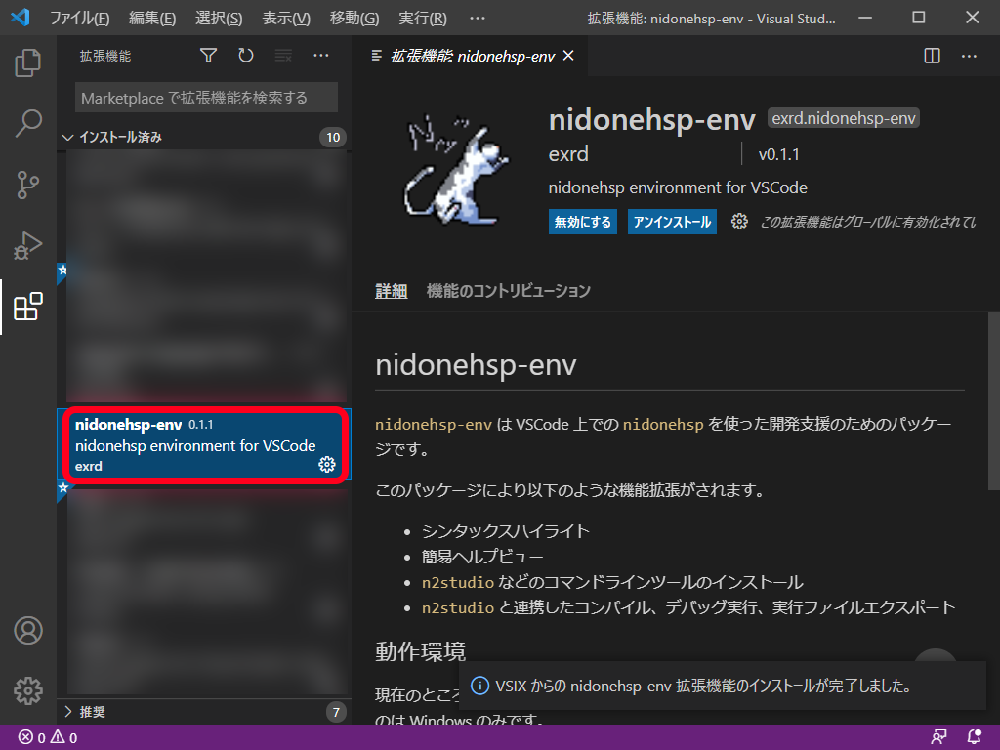

これで拡張機能のインストールは完了です。

### チュートリアル＞デバッグ実行まで

VSCodeではディレクトリ単位での管理が基本になります。

まずはエクスプローラ等で空のディレクトリを作ってみましょう。\
その後、VSCodeから作ったディレクトリを開きます。

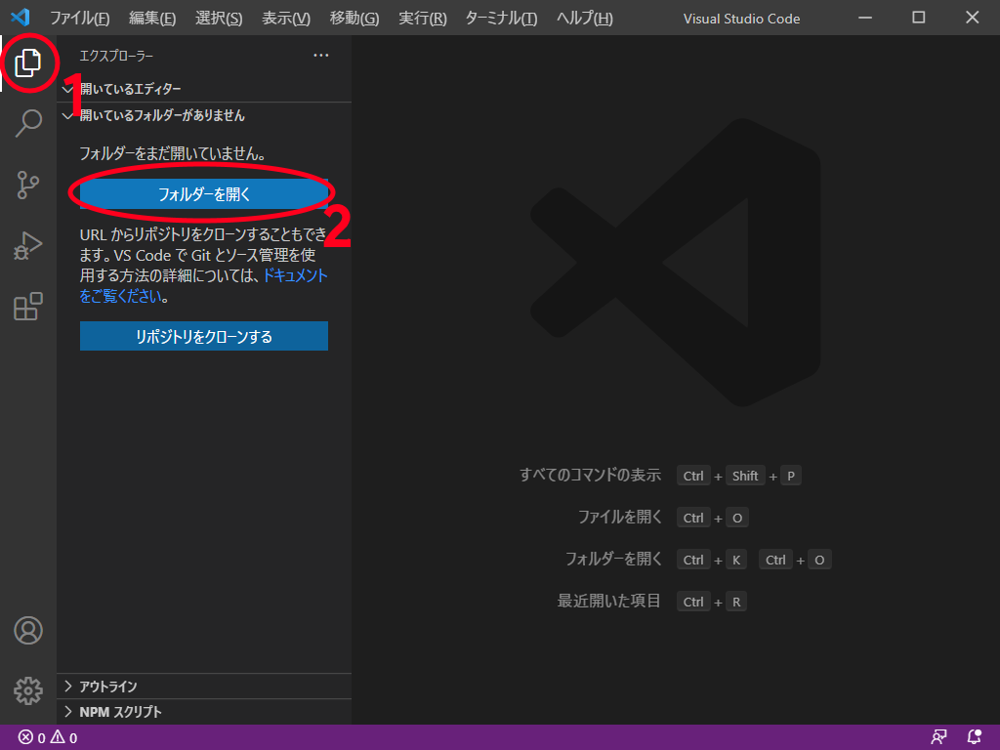

その後、新たにスクリプトファイルを追加します。

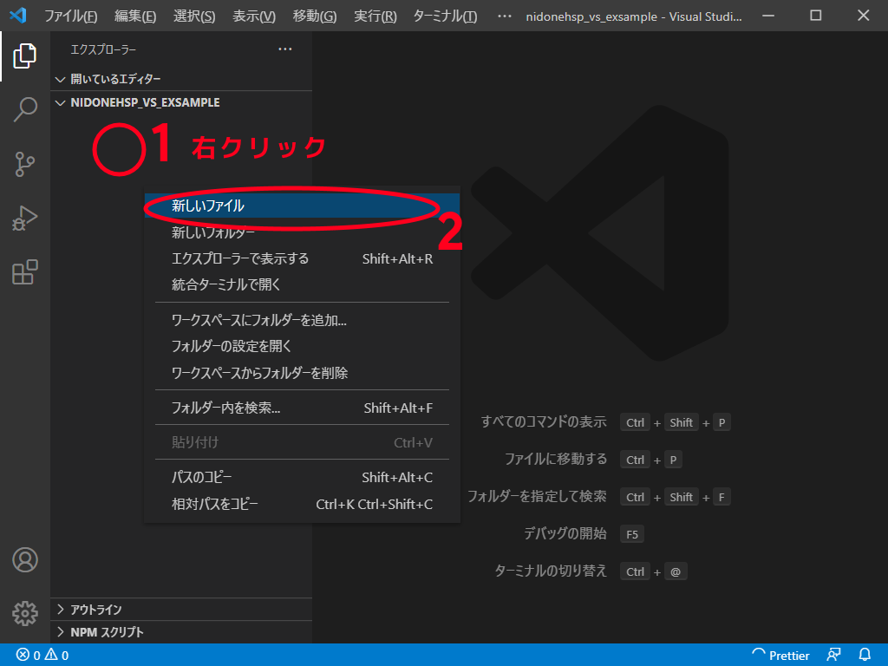

ここで、**`nidonehsp` のスクリプトファイルとして認識されるためには拡張子が `.nhsp` である必要があります**。

ここでは例として `myapp.nhsp` といったようなファイルを作成してみます。

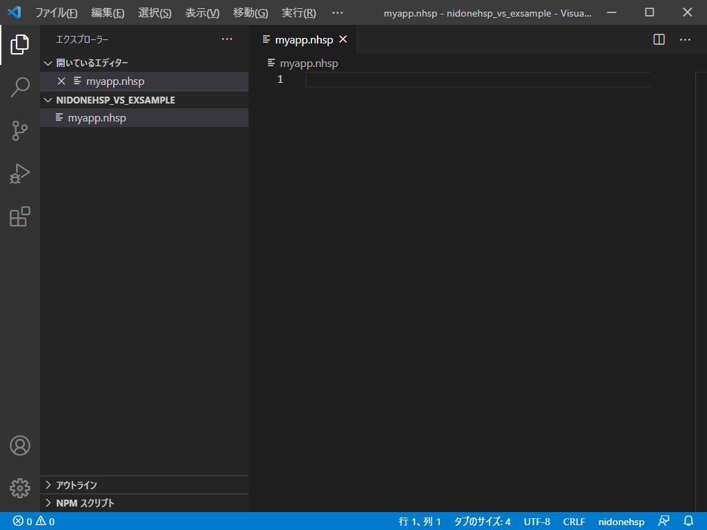

この状態で `myapp.nhsp` は `nidonehsp` のスクリプトとして認識されており、エディタとしてシンタックスハイライトなどが有効な状態となっています。

ここでは更に一歩進んで、デバッグ実行までをしてみましょう。

次のようなスクリプトを打ち込みます。

```
; Hello World と表示
mes "Hello World"
```

その後、実行パネルを開き、`launch.json ファイルを作成` を押します。

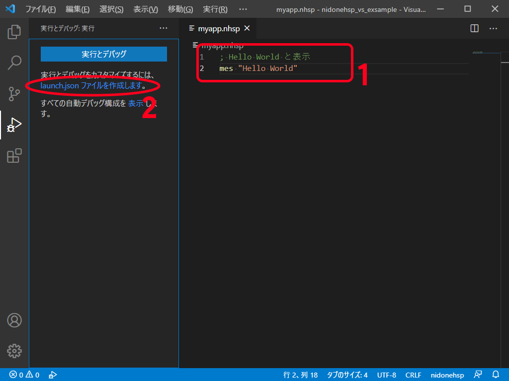

拡張子が `.nhsp` のため、自動で `nidonehsp` 用のデバッグ実行設定がなされた `launch.json` ファイルが生成され、開かれた状態になります。

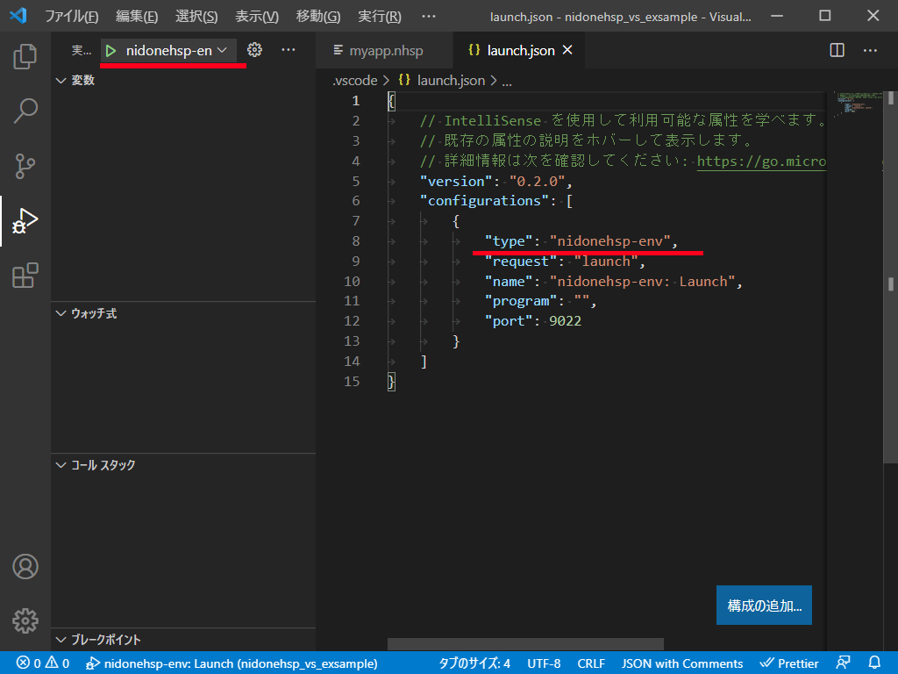

設定ファイル内に `nidonehsp` といった文字列が入っていることを確認してください。

ここまでくればもう後はデバッグ実行可能な状態になっています。\
VSCode 上で `myapp.nhsp` のタブを選び、エディタ上で開いた上で `F5` キーを押下することでデバッグ実行を開始できます。

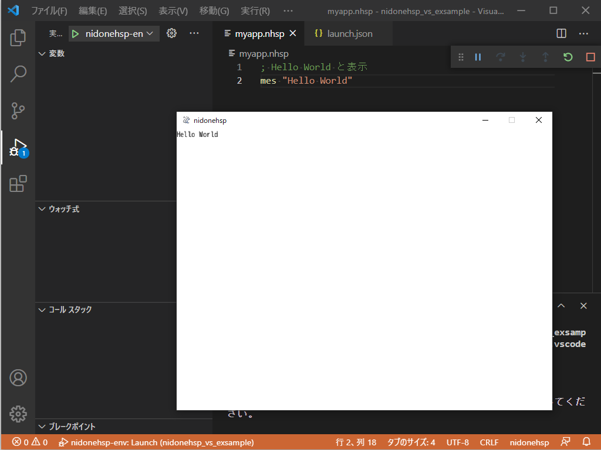

*※初期状態のデバッグ実行設定では、`現在エディタ上でアクティブに編集している.nhspスクリプトを実行対象とする`という挙動になっているため、デバッグ実行の際は対象のファイルをエディタ上で開いている必要があります。*

デバッグ実行がスタートし、`Hello World` と表示されたウィンドウが現れたらこのチュートリアルは完了です。

### ヘルプビュー

`F1` キーを押すことで命令のヘルプを見ることが出来ます。

例えばチュートリアルでの `myapp.nhsp` で、`mes` にカーソルをおいて `F1` キーを押下すると、`mes` という命令のヘルプが自動で開かれます。

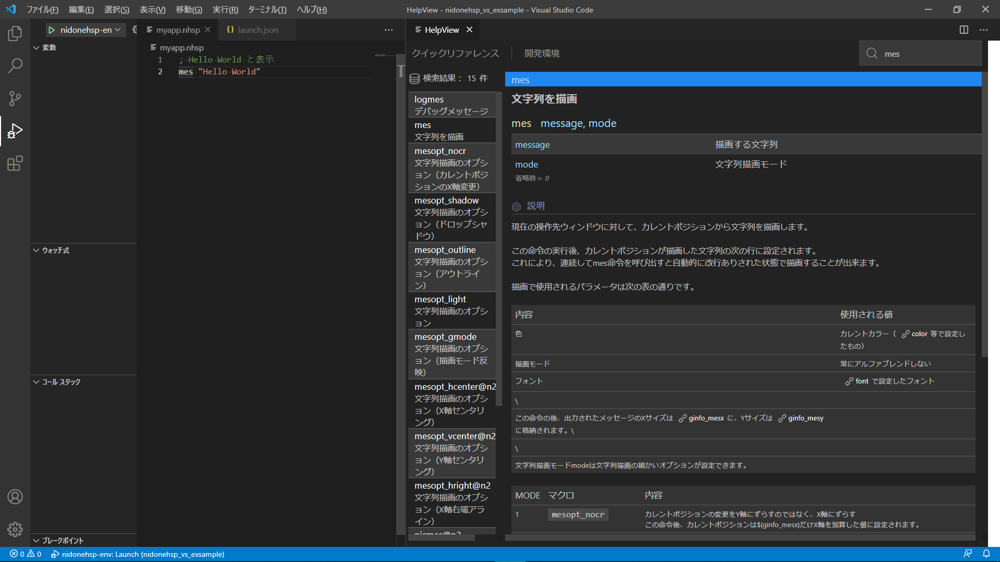

命令のパラメータや使い方を忘れた…といった場合に、素早く `F1` キーを押すことでヘルプを参照できます。

### 実行ファイルのエクスポート

`Ctrl+F9` キーを押すことで、スクリプトを実行できる実行ファイルを生成することができます。

デフォルトでは、実行ファイルの元になったスクリプトファイルと同じディレクトリに `nhsptmp` という名前で生成されます。

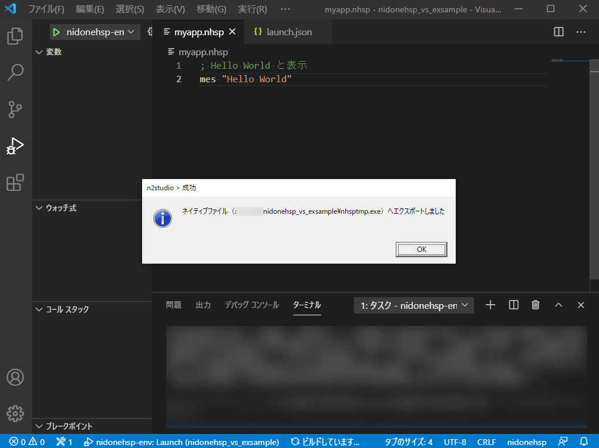

実行ファイル化する際に埋め込むファイルや、実行ファイルの名前についてなどは `#pack` や `#packopt` といった命令のヘルプを参照してください。


### その他の機能

`nidonehsp-env` の各機能は基本的にVSCodeの作法に則って実装されています。

例えばヘルプビューを開く操作は `nidonehsp-env.helpview` というIDのコマンドになっており、VSCodeの機能としてキーバインドの変更等が可能です。

他には、実行ファイルのエクスポートなどは、一度コマンドを通してはいますが実体は `nidonehsp-env.export` というIDのタスクになっており、
タスクとして扱うことで対象となるスクリプトファイルを固定したり、ターゲットプラットフォームの指定などが可能になります。

## コマンドラインツールを使った開発

コマンドラインツールでは `n2studio` が実質ほぼ全ての機能を担っています。\
そのため、詳細については `n2studio --help` で表示されるヘルプを参照してください。

## 付録

### デバッグ実行でのプロトコル

`n2studio` はデバッグ実行時、デバッグホストとのデータのやり取りには `DebugAdapterProtocol(DAP)` を用いています。

DebugAdapterProtocol は主に VSCode で使用されている、デバッグホストとデバッガ（デバッグアダプター）との通信のやりとりを定めたものです。

`n2studio` は現状 TCP 上での DebugAdapterProcol のみサポートしています。

*※TCP通信をサポートしているため、理論的にはリモートマシン上で動作している `n2sduio` のインスタンスとも通信することができます。*


[1]:quickReference.md
[2]:https://github.com/exrd/nidonehsp
